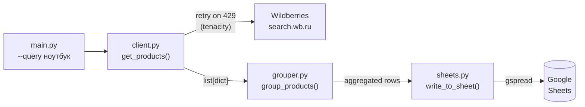

# MarketplaceSync

[](LICENSE)


Забирает товары из публичного поиска Wildberries по ключевому слову,
группирует по категории и бренду, считает агрегаты (средняя/мин/макс цена) и
записывает итог в Google Sheets. Показывает работу с rate limiting через
tenacity (exponential backoff на 429) и построение пайплайна
fetch → group → export.

## Архитектура



## Какое API используется

**Wildberries** — крупнейший маркетплейс России/СНГ. При поиске на сайте
браузер обращается к публичному endpoint:

```
GET https://search.wb.ru/exactmatch/ru/common/v5/search
    ?query=ноутбук&resultset=catalog&limit=100&sort=popular&page=1
```

Этот endpoint:
- **Не требует авторизации** — работает без ключей и регистрации
- Возвращает JSON с полями: id товара, название, бренд, категория, цена, скидка, рейтинг, количество отзывов
- **Лимиты**: официально не задокументированы; на практике стабильно работает при ≤1–2 req/s; при превышении возвращает 429

Ozon исключён: их search API требует регистрации продавца.

> **Ограничения**: это неофициальный публичный эндпоинт, не Seller API.
> Подробнее — в [секции ограничений](#ограничения) (Phase 3).

## Статус

- [x] Phase 1 — WB API client + tenacity retry
- [x] Phase 2 — группировка + Google Sheets + CLI
- [x] Phase 3 — CI + секция ограничений

## Стек

Python 3.12, httpx, tenacity, gspread, pytest.

## Быстрый старт

```bash
git clone https://github.com/flexxrap/marketplace-sync.git
cd marketplace-sync
python -m venv .venv && source .venv/bin/activate
pip install -r requirements.txt
cp .env.example .env
```

## Запуск CLI

```bash
python main.py --query "ноутбук"
# или с лимитом
python main.py --query "наушники" --limit 50
```

Без настроенного Google Sheets результат выводится в консоль:

```
Fetching products for 'ноутбук'...
  87 products fetched
  23 category/brand groups
  Google Sheets not configured — printing to stdout:

  Category             Brand            N       Avg      Min      Max  Rating
  -----------------------------------------------------------------------
  Ноутбуки             Lenovo          14   47 832₽   21 999₽   89 990₽    4.72
  Ноутбуки             ASUS            11   52 450₽   24 900₽   94 990₽    4.65
  Ноутбуки             HP               9   38 700₽   19 990₽   71 000₽    4.58
  Ноутбуки             Acer             8   35 200₽   18 500₽   62 990₽    4.61
  Аксессуары           Lenovo           6    2 450₽      890₽    5 990₽    4.43
  ...

Done in 1.8s
```

Полный прогон (fetch 100 товаров + группировка + вывод) занимает **~1–3 секунды**
в зависимости от скорости ответа WB API.

## Google Sheets

Чтобы экспортировать результат в таблицу:

1. В [Google Cloud Console](https://console.cloud.google.com/) создайте проект, включите **Google Sheets API** и **Google Drive API**.
2. Создайте Service Account → скачайте JSON-ключ.
3. Откройте нужный Spreadsheet и дайте Service Account email право **Editor**.
4. Пропишите в `.env`:

```env
GOOGLE_CREDENTIALS_FILE=/path/to/service-account.json
GOOGLE_SPREADSHEET_ID=ваш-spreadsheet-id
GOOGLE_WORKSHEET=MarketplaceSync  # имя листа (создастся автоматически)
```

## Тесты

```bash
pip install -r requirements-dev.txt
pytest
```

`tests/test_client.py` — клиент WB, HTTP замокан:
- нормализация полей (priceU → price_rub)
- retry на 429 (два фейла → успех на третьей попытке)
- исчерпание попыток после 4× 429
- пустой ответ

`tests/test_grouper.py` — чистая логика группировки:
- кол-во групп по (category, brand)
- агрегаты min/avg/max price
- агрегат avg_rating
- сортировка по count desc
- пустой ввод

## Ограничения

- **Неофициальный эндпоинт** — `search.wb.ru` не является частью публичного Seller API Wildberries. Wildberries не гарантирует стабильность структуры ответа, URL и доступности без авторизации. При изменении схемы ответа потребуется обновить `_normalize()` в `client.py`.
- **Read-only** — проект только читает данные. Запись/изменение товаров требует Seller API с OAuth-токеном продавца.
- **Geo-ограничения** — эндпоинт может быть недоступен за пределами России/СНГ. Тесты намеренно мокают HTTP, поэтому CI работает корректно на GitHub Actions (Ubuntu).
- **Лимиты** — официальных SLA нет; при агрессивном опросе сервер возвращает 429. Tenacity обрабатывает это с экспоненциальным backoff (до 4 попыток, макс. 30 с между ними).
- **Google Sheets** — для экспорта нужен service account; без него данные выводятся в stdout. Credentials хранятся локально и в `.gitignore`.
